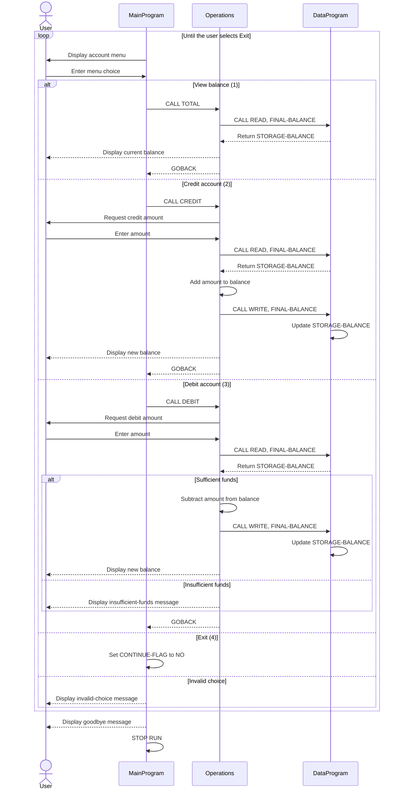

# Student Account COBOL Programs

This directory documents the COBOL student account example in `src/cobol`. The application is a console-based account management system that lets a user view a balance, credit an account, debit an account, or exit.

## Program Overview

### `main.cob` - `MainProgram`

`MainProgram` is the console entry point and user interface.

Key responsibilities:

- Displays the account management menu.
- Accepts a one-digit menu choice.
- Calls `Operations` with the matching six-character operation code:
  - `TOTAL ` for viewing the balance.
  - `CREDIT` for adding funds.
  - `DEBIT ` for removing funds.
- Repeats the menu until the user selects option `4`.
- Displays an error for choices outside `1` through `4`.

### `operations.cob` - `Operations`

`Operations` applies account actions requested by `MainProgram`.

Key responsibilities:

- `TOTAL `: Reads the stored balance from `DataProgram` and displays it.
- `CREDIT`: Accepts an amount, reads the current balance, adds the amount, writes the result back, and displays the new balance.
- `DEBIT `: Accepts an amount, reads the current balance, and subtracts the amount only when sufficient funds are available.
- Displays an insufficient-funds message when a debit is greater than the current balance.

`Operations` receives the operation code through its linkage section and returns to its caller with `GOBACK`.

### `data.cob` - `DataProgram`

`DataProgram` provides the balance storage service used by `Operations`.

Key responsibilities:

- Maintains `STORAGE-BALANCE` in working storage.
- Starts with a balance of `1000.00`.
- Handles the `READ` operation by copying the stored balance into the caller's `BALANCE` field.
- Handles the `WRITE` operation by copying the caller's `BALANCE` field into storage.
- Returns to the caller with `GOBACK`.

The balance is held in memory for the lifetime of the running program. It is not written to a file or database, so it resets to `1000.00` when the program starts again.

## Student Account Business Rules

- A new program run begins with a balance of `1000.00`.
- Credits increase the stored balance by the entered amount.
- Debits are allowed only when the current balance is greater than or equal to the entered amount.
- A debit that exceeds the current balance is rejected and does not change the stored balance.
- The application does not implement overdrafts, fees, interest, transaction history, persistence across runs, or account identification.
- Menu choices must be `1`, `2`, `3`, or `4`; any other choice is rejected with an error message.
- Amounts and menu selections are accepted directly from console input. The COBOL source does not explicitly validate negative values, zero values, malformed numeric input, or maximum field limits.

## Program Interaction

```text
MainProgram
    |
    +-- TOTAL / CREDIT / DEBIT --> Operations
                                      |
                                      +-- READ / WRITE --> DataProgram
```

`DataProgram` is called by `Operations` with a six-character operation and a balance field. The operation strings are space-padded where necessary to match the `PIC X(6)` declarations.

## Application Data Flow


